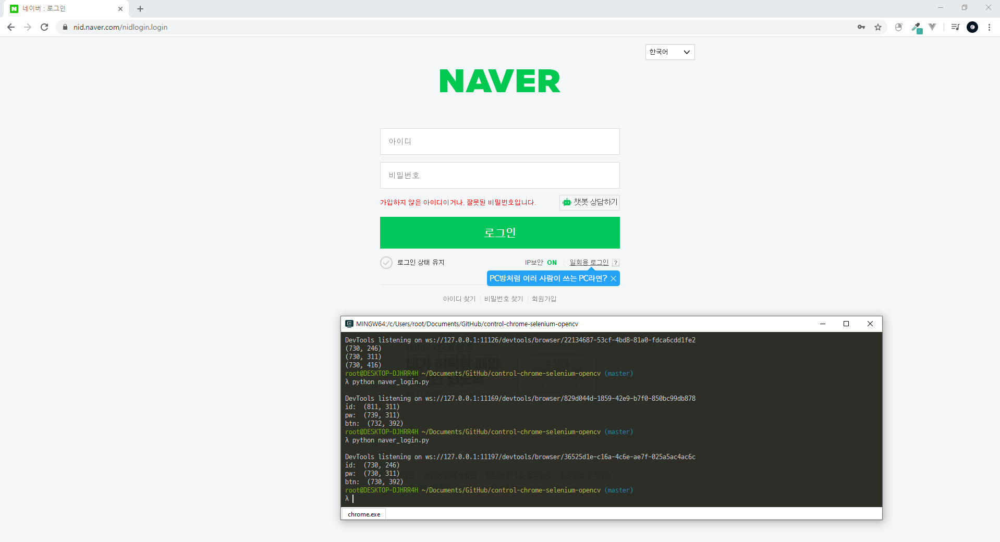

# 네이버 로그인 예제

동작방식은 다음과 같습니다.

1. selenium에서 원하는 요소를 찾고, 이미지 파일로 저장
2. opencv의 템플릿 매칭을 이용하여 **화면에서** 요소를 찾음
3. 마우스와 키보드를 조작

주의 사항은 

1. selenium에서 이미지를 찾을 때는 headless 모드로 화면이 상관 없지만, 로그인을 할 때는 인터넷 브라우저에서 네이버 로그인 창을 켜놓으셔야 합니다.
+ 언어도 한글/ 영어 체크



2. 요소의 위치를 넘긴 후, 그 위치에 20을 더해서 클릭합니다. (요소의 끝을 클릭해도 input창을 클릭하지 못하는 걸 방지)
``` python
px = position[0]+20
py = position[1]+20
```

3. input 창에 값을 입력할 때 copy/paste를 이용합니다.