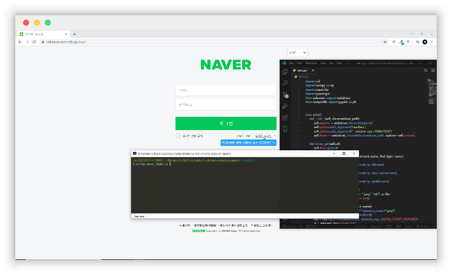

# control-chrome-selenium-opencv

selenium에서 봇 탐지를 우회할 목적으로 만들어졌습니다.



## install

``` bash
git clone https://github.com/ytype/control-chrome-selenium-opencv.git
pip install -r requirements.txt
python naver_login.py
```

1. selenium으로 요소의 이미지를 찾음
2. opencv의 템플릿 매칭으로 화면에서 위치를 찾음
3. pyperclip와 pyautogui 로 조작

네이버 로그인 예제는 [naver login(kr)](EXAMPLE.MD) 